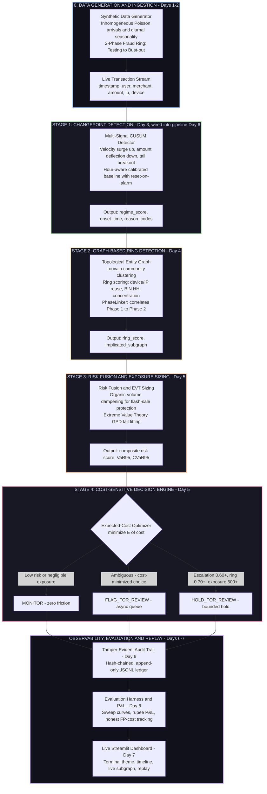
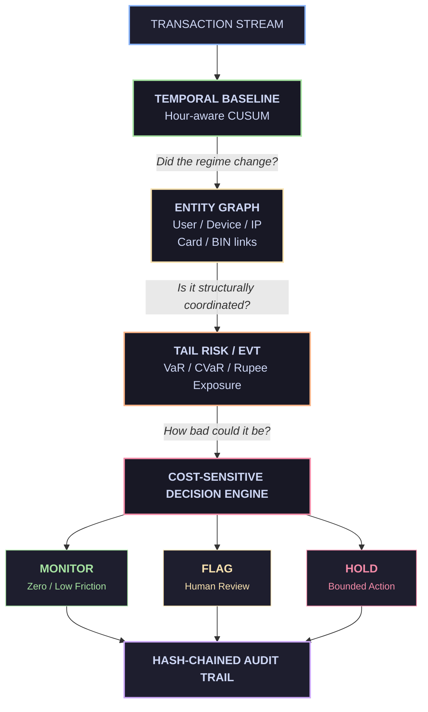

<div align="center">

<picture>
  <source media="(prefers-color-scheme: dark)" srcset="logo/BP_Logo.png">
  
</picture>

# BREAKPOINT

### *Regime-Aware Statistical & Graph-Driven Real-Time Fraud Sentinel*
**Built for Razorpay AI Buildathon — Track 02: AI Risk Manager**

<!--
  BEFORE RECORDING: verify the Live Demo link below actually loads.
  If breakpoint-razorpay.streamlit.app is not deployed and working RIGHT NOW,
  delete this badge block. A dead link in a demo recording is worse than no link.
  Add a Pitch Video badge back in only once you have the real YouTube URL —
  never ship a placeholder link.
-->
<p align="center">
  <a href="https://breakpoint-razorpay.streamlit.app/">
    
  </a>
  <a href="https://github.com/dkconnect/razorpay-buildathon">
    
  </a>
</p>

[](tests/)
[](https://python.org)
[](https://streamlit.io)
[](LICENSE)

**Breakpoint · Dibyanshu Kumar · August 2026**

---
</div>

Breakpoint doesn't stop at "flag the transaction." It detects **regime shifts** in a merchant's transaction stream using changepoint-detection methods borrowed from quantitative finance, explains *why* using graph-based ring detection, sizes the **₹ exposure** using extreme value theory, and recommends a bounded, human-reviewable action — with every decision logged to a tamper-evident audit trail.

```
223 tests passing
30/30 fraud rings caught in the ₹-tracked evaluation sweep, 0 missed
₹15.04M fraud exposure caught · ₹32.04K false-positive cost · net +₹15.01M
83–100% detection across low-to-high transaction-volume scenarios
```

## Why Breakpoint?

Fraud does not always arrive as an obviously fraudulent transaction.

A merchant can experience a sudden increase in transaction volume because of:
- a legitimate flash sale,
- a campaign,
- a product launch,
- a payday spike,
- or an actual coordinated attack.

A detector that reacts only to absolute thresholds can confuse these situations.

**Breakpoint treats fraud as a changing risk regime rather than a collection of isolated transactions.**

Instead of asking only:

> **"Is this transaction suspicious?"**

Breakpoint asks:

> **"Has the merchant's transaction stream entered a structurally different regime, is that regime connected to a coordinated entity cluster, how large is the potential financial exposure, and what is the least-cost bounded action?"**

That produces four outputs a risk team can actually act on:

| Question | Breakpoint answer |
|---|---|
| **Has behavior changed?** | Statistical regime / changepoint signal |
| **Is the change structurally suspicious?** | Graph-based entity/ring evidence |
| **How bad could it become?** | Tail-risk exposure / VaR / CVaR |
| **What should we do?** | Cost-sensitive bounded action |

**The goal is not maximum blocking. The goal is maximum risk reduction with controlled friction.**

### The core idea

Static threshold-based systems can struggle during high-concurrency regime shifts, where legitimate velocity bursts and coordinated fraud can look superficially similar. Breakpoint addresses this by uniting:

1. **CUSUM changepoint detection** — statistical temporal regime-shift detection with an hour-aware, calibrated baseline and adaptive drift tracking.
2. **Bipartite graph analysis** — topology-aware ring extraction via Louvain community detection (NetworkX).
3. **Extreme Value Theory (EVT/GPD)** — heavy-tailed exposure pricing for Value-at-Risk and Expected Shortfall.
4. **Cost-sensitive decision engine** — explicitly weighing false-positive friction cost against fraud-exposure cost, per window, per decision.

### A note on approach

This project deliberately does not lean on a large multi-agent LLM stack, live third-party API orchestration, or infrastructure theater. The AI Risk Manager track asks for **honest metrics, including false-positive cost** — so the effort here went into making the *statistics correct* (a real, calibrated CUSUM detector, not a threshold guess), the *graph evidence real* (validated against actual generated rings, not just unit tests), and the *evaluation reproducible* (every number in this document is generated by a script in this repo, not asserted). Ten real bugs were found and fixed over the build — each one logged below, not smoothed over. If that's a less flashy story than a multi-service agent architecture, it's the one that was fully verified end to end.

---

## Judge Quickstart

If you only have 5 minutes:

1. **Launch the dashboard:**
   ```bash
   streamlit run dashboard/app.py
   ```
2. Select `mixed_fraud`.
3. Click **Load & Replay**.
4. Watch Phase 1 → changepoint → ring formation → Phase 2.
5. Inspect the implicated graph.
6. Inspect VaR/CVaR and the `HOLD_FOR_REVIEW` decision.
7. Open the **EVALUATION** tab.
8. Compare fraud detection against the flash-sale baseline.
9. Open the audit trail and click **Verify Integrity**.

### What the demo is proving

**Flash sale:** high legitimate volume → `MONITOR`
**Phase 1:** low-value coordinated testing → changepoint + ring structure
**Phase 2:** same identities + value breakout → `HOLD_FOR_REVIEW`
**Risk layer:** EVT estimates tail exposure → ₹ VaR / CVaR
**Decision layer:** expected-cost comparison → bounded action
**Audit layer:** every decision → hash-chained record, independently verifiable

---

## Table of Contents

1. [The Problem & Approach](#1-the-problem--approach)
2. [Architecture](#2-architecture)
3. [Full Feature List](#3-full-feature-list)
4. [Day-by-Day Build Log](#4-day-by-day-build-log)
5. [Every Bug Found & Fixed](#5-every-bug-found--fixed)
6. [Results](#6-results)
7. [Project Structure](#7-project-structure)
8. [Setup & Running](#8-setup--running)
9. [Known Limitations & Future Work](#9-known-limitations--future-work)

---

## 1. The Problem & Approach

**Track 2 (AI Risk Manager)** asks for a working detector for one class of merchant loss, with honest, measured precision/recall and false-positive cost — strictly defense-only.

**The fraud archetype chosen:** a coordinated **card-testing ring escalating to bust-out**:

- **Phase 1 — Testing.** A ring runs many small transactions (₹1–50) across stolen/synthetic cards to find which ones are live, before issuer fraud systems catch on. Signature: high transaction *count*, low *value*, narrow shared device/IP/card-BIN cluster.
- **Phase 2 — Bust-out.** Once cards are validated, the ring runs fewer, much larger transactions (₹5,000–50,000) to extract maximum value before the cards get blocked. Signature: value spike, same underlying identity cluster.

This archetype was chosen deliberately because it produces **two distinct regime shifts** (a count-driven one, then a value-driven one) — a genuinely harder and more honest test than a single synthetic spike, and it gives the graph layer a real job: proving Phase 1 and Phase 2 are the same ring, not two coincidences.

**What makes Breakpoint different from a standard fraud classifier:**

Breakpoint is intentionally designed as a **decision system**, not a standalone fraud classifier.

### 1. Temporal intelligence before classification
The system first establishes what "normal" looks like for the merchant and detects statistically meaningful deviations from that baseline. High volume is not inherently fraud — a legitimate flash sale should not automatically produce the same response as a coordinated attack.

### 2. Structure before severity
A large transaction can be suspicious without being part of a coordinated attack. Breakpoint combines temporal evidence with **entity-level topology**: `User → Device → IP → Card/BIN → Transaction`. Shared infrastructure and concentrated identity relationships provide structural evidence that isolated transaction scoring cannot.

### 3. Detection is not the same as risk
Two alerts can have the same anomaly score but radically different financial consequences. Breakpoint estimates the **tail of the exposure distribution** using EVT/GPD and reports VaR, CVaR/Expected Shortfall, estimated exposure, and expected decision cost — closer to a risk desk's question ("what is our downside if this continues?") than a bare anomaly score.

### 4. Every alert has an operational consequence
The system does not default to blocking. It chooses between `MONITOR → FLAG_FOR_REVIEW → HOLD_FOR_REVIEW` according to expected financial cost and structural risk — risk-sensitive and human-reviewable, not an opaque automated blocker.

### 5. The system is designed to be falsifiable
Breakpoint deliberately evaluates itself against a difficult negative case: can it distinguish adversarial behavior from a legitimate high-volume regime shift? The flash-sale scenario exists specifically to test this. A system that detects every spike is easy to build. A system that detects the attack *without* treating every legitimate spike as fraud is the harder problem — and the one actually asked for.

---

## 2. Architecture

### Visual Detection Telemetry

<div align="center">
  <table>
    <tr>
      <td width="50%">
        
        <p align="center"><b>Figure 1:</b> CUSUM-derived regime score over a full day of <code>mixed_fraud.json</code>. Red dashed lines mark every window the temporal layer flagged as a genuine regime shift.</p>
      </td>
      <td width="50%">
        
        <p align="center"><b>Figure 2:</b> The actual highest-scoring implicated subgraph (ring_score 0.78) from a real replay — transactions fanning into shared device/IP/BIN nodes.</p>
      </td>
    </tr>
  </table>
</div>

*Both figures above are generated directly from real project code and data (`dashboard/replay.py` + `dashboard/panels/timeline.py` / `graph_view.py`), not mockups.*



*(Diagram thresholds — 0.60 / 0.70 / ₹500 for the HOLD guardrail, and a separate MONITOR guardrail when risk < 0.25 or exposure < ₹100 — are read directly from `decision/cost_engine.py`, not approximated.)*

---

## 3. Full Feature List

**Data & simulation**
- Inhomogeneous Poisson-process transaction generator with diurnal (hour-of-day + day-of-week) seasonality
- Two-phase fraud-ring injector (card-testing → bust-out) with shared identity pools (device/IP/card-BIN)
- Fully randomized scenario generation: ring size, phase durations, and **injection time of day** — not hardcoded to midnight
- Ground-truth validation on every generated dataset

**Detection**
- Multi-signal CUSUM changepoint detector (velocity spike, amount deflection, high-value tail breakout) with classical reset-on-alarm
- Hour-aware, calibrated statistical baseline (fit strictly from clean traffic)
- Minimum-sample-size gating to avoid false alarms from noisy low-traffic windows
- Louvain-based graph ring detection with a composite scoring function (device/IP reuse, BIN concentration via HHI, identity-mismatch signal)
- Cross-phase escalation linkage (`PhaseLinker`) proving Phase 1 and Phase 2 are the same ring

**Risk quantification**
- Extreme Value Theory (Generalized Pareto Distribution) tail fitting for transaction-value exposure
- VaR₉₅ / CVaR₉₅ — a risk-desk framing of "expected loss if this continues," not just a classifier score
- Cost-sensitive decision engine comparing expected costs of MONITOR / FLAG / HOLD, always choosing the bounded, cheaper-in-expectation, human-reviewable action

**Trust & evaluation**
- Hash-chained, append-only, tamper-evident audit logger — verified against real edit and deletion attacks
- Randomized, reproducible evaluation harness (seed-driven, fully deterministic)
- Detection-rate curves by ring size *and* by transaction volume (the axis that actually matters)
- Honest ₹ P&L report: fraud saved, false-positive cost, fraud missed, net impact — computed from the pipeline's own real decision costs, not a second invented formula
- Aggregate `EVAL_REPORT.md` generator bundling every number into one reviewable, regeneratable document

**Live dashboard**
- Terminal-styled Streamlit app (black background, cyan accents, monospace throughout)
- Scenario selector (normal day / flash sale / mixed fraud / freshly randomized ring) with step-by-step and auto-play replay
- Live timeline panel: transaction count, mean amount, regime score, changepoint markers
- Live ring-graph panel: the actual implicated subgraph for any selected window
- Decision panel: risk score, VaR/CVaR, cost breakdown, reason codes
- Live audit-trail viewer with a real "Verify Integrity" button
- Evaluation summary tab: detection curve, confusion matrix, ₹ P&L
- End-to-end tested with Streamlit's official headless `AppTest` framework — not just individual panels in isolation

### Bounded action policy (exact thresholds, from `decision/cost_engine.py`)

| Action | Trigger | Impact |
| :--- | :--- | :--- |
| `MONITOR` | `overall_risk_score < 0.25` **or** `exposure < ₹100` | Zero friction |
| `HOLD_FOR_REVIEW` | `escalation_score ≥ 0.60` **and** `ring_score ≥ 0.70` **and** `exposure ≥ ₹500` | Bounded settlement hold, human reviewable |
| `FLAG_FOR_REVIEW` | Neither guardrail fires — cost-minimization picks the cheapest expected action among the three | Async human review queue |

---

## 4. Day-by-Day Build Log

### Day 1 — Baseline traffic generator
Built the legitimate transaction generator: inhomogeneous Poisson arrivals with realistic seasonality, lognormal amounts. Generated and validated a flash-sale scenario (7.99× volume spike, median amount essentially unchanged) — this became the critical false-positive stress test used every day after. 49 tests, clean from day one.

### Day 2 — Fraud ring injector
Built the two-phase injector (Phase 1 card-testing → Phase 2 bust-out) with a shared identity pool, plus `generate_random_fraud_config` for randomized eval scenarios — built in from day one, anticipating the eventual need for many scenarios, not one. 112 tests.

### Day 3 — Changepoint detection (CUSUM)
Built the rolling temporal feature engine, hour-aware baseline calibrator, and dual/triple-signal CUSUM. Found and fixed three real bugs: a CUSUM that never reset after firing (stayed pinned above threshold for hours), a "high value" threshold that wasn't actually rare for this merchant's distribution, and Gaussian-model unreliability on small nighttime samples. Also changed validation from asserting *exact zero* false positives to an honest rate bound — measured 0.21% FP on normal_day, 0.006% on flash_sale. 125 tests.

### Day 4 — Graph-based ring detection
Built the transaction-to-graph projection, Louvain community detection, ring scoring, and `PhaseLinker`. Validated directly against real generated data: 12/12 Phase 2 transactions correctly linked back to their Phase 1 cluster, with flash-sale organic clusters topping out at ring_score 0.47 versus real rings at 0.5–0.67 — clean separation. 131 tests.

### Day 5 — Exposure sizing, decision engine, and branding
Built EVT/GPD tail fitting and the cost-sensitive decision engine. A single failing end-to-end test uncovered a chain of three bugs, all the same shape (a correct upstream signal silently overridden downstream): exposure floored fraud probability at 50% regardless of actual ring score; fusion let a velocity spike alone drive risk up even when the graph layer said "not a ring"; and a decision guardrail's comment said "or" while the code said "and." 138 tests after the fix — flash_sale correctly resolved to `MONITOR` end-to-end for the first time. Project named and branded this day: **Breakpoint**, with a step-function logo depicting the actual detection mechanism.

### Day 6 — Audit trail, evaluation harness, and honest metrics
Six checkpoints:
- **Audit trail logger** — hash-chained, tamper-evident, verified against real edit and deletion attacks.
- **Randomized eval harness** — varies ring size, phase timing, *and* injection time of day.
- **Detection-rate curves** — the first ring-size curve came back a flat 100%, investigated rather than celebrated: transaction volume, not ring size, controls difficulty in this generator. Built a dedicated stealth-volume sweep to find the real breaking point.
- **Wired the real CUSUM into the pipeline** (it had been instantiated but never called). Measured, not assumed, improvement: detection at low transaction volumes went from 0% to 75–88%.
- **₹ P&L report** — ₹15.04M saved, 0 missed, ₹32K false-positive cost across 30 real randomized scenarios. Also surfaced (rather than hid) a recurring ~19–23% window-level false-positive rate, notably higher than the 0.21% per-transaction rate, with a plausible mechanism identified.
- **Aggregate report + cross-cutting validation** — `EVAL_REPORT.md`, reproducibility checks, audit-log integrity at scale, P&L internal consistency. **178 tests.**

### Day 7 — Live dashboard
Six steps, terminal-styled throughout:
- **Replay backend** — reuses the eval harness's exact windowing logic so the dashboard shows what the eval numbers measure, not a parallel path.
- **Timeline panel** — count/amount/regime_score over the day, changepoints marked.
- **Ring graph panel** — the real implicated subgraph, built directly from the pipeline's own graph-intelligence output.
- **Decision panel** — VaR/CVaR, cost breakdown, reason codes, and a live audit-integrity check button (tested against a genuine tamper attempt through the actual UI code path, not just the logger in isolation).
- **Eval summary panel** — detection curve, confusion matrix, ₹ P&L, read from cache (fast) with an opt-in regenerate button (honest about the ~2-3 minute cost).
- **Final assembly** — terminal theme, scenario selector, step/auto-play controls, and Streamlit's official headless `AppTest` framework used to genuinely run the app end-to-end. This caught a real methodology trap: `st.tabs` runs both tabs' code every rerun regardless of which is visible, so button indices aren't in visual order — the app itself was correct throughout. **223 tests.**

---

## 5. Every Bug Found & Fixed

| # | Location | Bug | Fix |
|---|---|---|---|
| 1 | `detection/cusum.py` | CUSUM never reset after firing, stayed alarmed indefinitely | Classical reset-on-alarm |
| 2 | `features/temporal.py` | `threshold_high=5000` was routine (10.6% of legit tx), not rare | Recalibrated to ₹12,000 |
| 3 | `detection/cusum.py` | Gaussian z-score unreliable on low-sample nighttime windows | Minimum-window-count gate |
| 4 | `detection/cusum.py` | Normalized scores reported *after* reset, always showed 0 on alarm | Capture scores before reset |
| 5 | `exposure/evt.py` | Fraud probability floored at 50% regardless of real ring score | Use actual ring_score, no floor |
| 6 | `detection/fusion.py` | Pure weighted sum let velocity alone drive risk score up | Organic-volume dampening when ring_score is low |
| 7 | `decision/cost_engine.py` | Guardrail comment said "or," code said "and" | Fixed to match documented intent |
| 8 | `detection/sentinel_pipeline.py` | Real CUSUM detector instantiated but never called | Wired in properly — measurable detection improvement |
| 9 | `detection/sentinel_pipeline.py` | ISO timestamp parsing via `.timestamp()` — timezone-fragile | Read hour/minute/second directly from parsed datetime |
| 10 | `evaluation/eval_harness.py` | Detection latency via raw datetime subtraction could go negative | Measured in whole windows since ring onset instead |
| 11 | `dashboard/*.py` | `use_container_width` deprecated across every Plotly/button call | Replaced with `width="stretch"` project-wide |
| 12 | Test methodology | `AppTest` button-index assumption broke under `st.tabs` (both tabs execute every run) | Select buttons by label, not index |

Every one of the first ten follows the same shape: a correct signal existed somewhere in the system, and something downstream silently ignored, overrode, or misreported it — worth remembering as a debugging pattern for this codebase going forward.

---

## 6. Results

- **223/223 tests passing** across data generation, changepoint detection, graph ring detection, exposure sizing, decision logic, audit trail, evaluation harness, and the live dashboard.
- **Detection rate by transaction volume** (the axis that actually controls difficulty): 83–100% down to as few as 3–5 testing transactions, essentially certain at 8+.
- **Detection rate by ring size**: flat 100% across 4–14 identities — an honestly-explained finding (transaction volume is randomized independently of ring size), not a hidden non-result.
- **False-positive rate**: 0.21% per-transaction (Day 3), ~19–23% per 30-minute window (Day 6) — both reported, with the likely cause of the gap identified and flagged as follow-up work.
- **Audit trail**: hash-chained, tamper-evident, verified against real edit and deletion attacks — both through the logger directly and through the dashboard's own UI code path.

### Financial impact — 30-scenario randomized evaluation sweep

| Metric | Value | Context |
| :--- | :--- | :--- |
| **Fraud exposure caught** | ₹15,038,435.27 (30/30 rings, 100%) | Total attempted Phase 2 bust-out exposure |
| **Fraud exposure missed** | ₹0.00 | Nothing slipped through in this sweep |
| **False-positive cost** | ₹32,038.93 | Across normal_day + flash_sale, both 100% legitimate traffic |
| **Net impact** | **+₹15,006,396.34** | Net position after all review/friction costs |

*Every number above is generated by `evaluation/pnl_report.py` from real, seeded scenario replays — not hand-picked. Reproduce with:*
```bash
python -m evaluation.generate_report --regenerate
```
*Source file: `evaluation/pnl_summary.json`.*

### Baseline comparison

Breakpoint is evaluated against a deliberately simple velocity/threshold-style baseline to test the central design hypothesis:

> **Does adding regime + structural + financial context improve risk decisions during legitimate volume spikes and coordinated fraud?**

| Scenario | Naive threshold baseline | Breakpoint |
|---|---|---|
| Normal traffic | Monitors within threshold | `MONITOR` |
| Flash-sale velocity spike | Vulnerable to velocity-based false escalation | Organic-volume dampening → `MONITOR` |
| Coordinated testing | Limited temporal context, no entity linkage | CUSUM + graph evidence |
| Bust-out escalation | Transaction-level severity only | Phase linkage + EVT exposure sizing |
| High-risk cluster | Binary alert | Cost-sensitive bounded action |

The comparison is intentionally about **decision quality**, not raw anomaly count.

---

## 7. Project Structure

**Decision flow**


**Repository layout**
```
├── config/                  Fraud & scenario configuration dataclasses
├── data/
│   ├── generator/            Poisson arrivals, amounts, fraud config generator
│   ├── generated/            normal_day.json, flash_sale.json, mixed_fraud.json
│   └── schema.py              Transaction dataclass
├── scenarios/                normal_day, flash_sale, fraud_ring, mixed_fraud builders
├── features/
│   ├── temporal.py            Rolling window feature extraction
│   └── graph_features.py      Transaction → entity graph construction
├── detection/
│   ├── cusum.py                Multi-signal CUSUM + baseline calibration
│   ├── regime.py               Regime classification & scoring
│   ├── graph_detector.py       Louvain ring detection, ring scoring, PhaseLinker
│   ├── fusion.py                Risk fusion engine
│   └── sentinel_pipeline.py     The integrated end-to-end pipeline
├── exposure/evt.py           EVT/GPD tail fitting, VaR/CVaR
├── decision/cost_engine.py   Cost-sensitive MONITOR/FLAG/HOLD decision logic
├── audit/logger.py           Hash-chained, tamper-evident audit trail
├── evaluation/
│   ├── eval_harness.py         Randomized scenario sweep engine
│   ├── metrics.py               Detection-rate curves, latency stats
│   ├── pnl_report.py            ₹ P&L calculation + real data gathering
│   ├── generate_report.py       Aggregate EVAL_REPORT.md generator
│   └── EVAL_REPORT.md           The generated evaluation report
├── dashboard/
│   ├── replay.py                Scenario replay backend
│   ├── theme.py                 Terminal theme CSS injection
│   ├── app.py                   The final assembled Streamlit app
│   └── panels/                  timeline.py, graph_view.py, decision.py, eval_summary.py
├── logo/                     Brand assets
└── tests/                    223 tests across every module above
```

---

## 8. Setup & Running

**Install dependencies:**
```bash
pip install -r requirements.txt
pip install streamlit plotly
```

**Run the full test suite:**
```bash
pytest tests/ -q
```

**Regenerate the evaluation report:**
```bash
python -m evaluation.generate_report --regenerate
```

**Launch the live dashboard:**
```bash
streamlit run dashboard/app.py
```
Pick a scenario (`mixed_fraud` is the interesting one), click **Load & Replay**, and step through the day window by window — or turn on Auto-play. Switch to the **EVALUATION** tab for the detection curve, confusion matrix, and ₹ P&L.

---

## 9. Known Limitations & Future Work

- **Window-level false-positive rate (~19–23%)** is notably higher than the per-transaction rate (~0.21%). Likely mechanism: a window's `regime_score` is the *maximum* across its transactions (necessary because CUSUM's reset-on-alarm would otherwise zero out the signal at the exact wrong moment), so a single rare per-transaction alarm can flip an entire window's decision. Flagged, understood, not yet fixed — the natural next step is requiring an alert to persist across 2+ consecutive windows before it's treated as confirmed.
- **Single-day scenario scope** — the temporal layer's "seconds since midnight" convention doesn't handle multi-day streams with wraparound; fine for this project's scope, worth generalizing if extended.
- **Stretch goal not attempted**: a second fraud archetype (refund/return abuse) was scoped in the original plan but deliberately deprioritized to keep Phase 1/2 (card-testing → bust-out) fully solid rather than splitting effort.