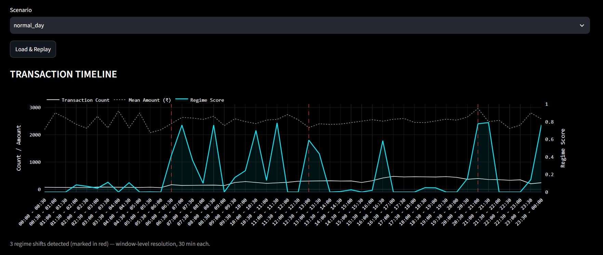
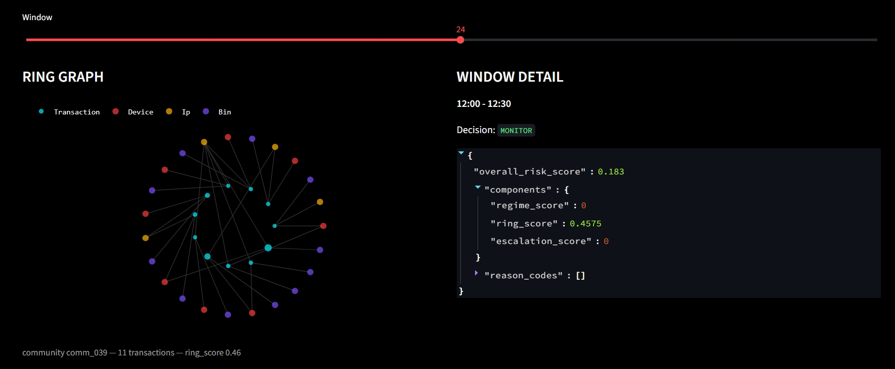

<picture>
  <source media="(prefers-color-scheme: dark)" srcset="logo/BP_Logo.png">
  
</picture>

# BreakPoint

#### Temporary Preview 

<picture>
  <source media="(prefers-color-scheme: dark)" srcset="images/preview1.jpeg">
  
</picture>

<picture>
  <source media="(prefers-color-scheme: dark)" srcset="images/preview3.jpeg">
  
</picture>
