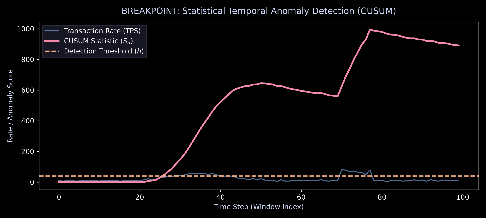
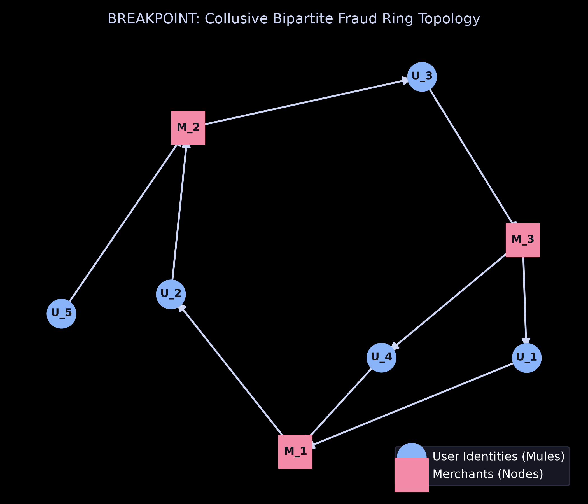
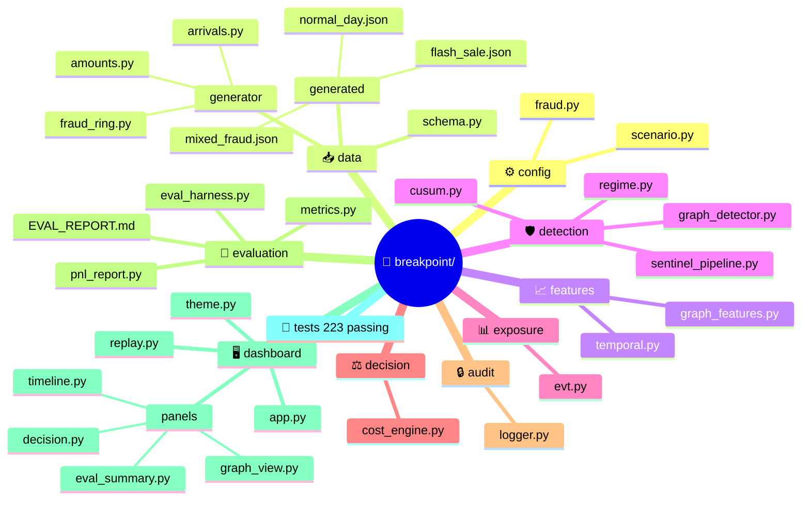

```mermaid
flowchart TD
    subgraph S0[" 0. DATA GENERATION & INGESTION (Days 1–2) "]
        GEN["Synthetic Data Generator<br>• Inhomogeneous Poisson arrivals & diurnal seasonality<br>• 2-Phase Fraud Ring (Testing → Bust-out)"]
        STREAM["Live Transaction Stream<br>(t_i, User, Merchant, Amount, IP/Device)"]
        GEN --> STREAM
    end

    subgraph S1[" STAGE 1: CHANGEPOINT DETECTION (Day 3 & Day 6) "]
        STREAM --> CUSUM["Multi-Signal CUSUM Detector<br>• Velocity Surge ↑ | Amount Deflection ↓ | Tail Breakout<br>• Hour-aware calibrated baseline with reset-on-alarm"]
        CUSUM --> S1_OUT["Output: regime_score, onset_time, reason_codes"]
    end

    subgraph S2[" STAGE 2: GRAPH-BASED RING DETECTION (Day 4) "]
        S1_OUT --> GRAPH["Topological Entity Graph<br>• Louvain community clustering<br>• Ring scoring (Device/IP reuse, BIN HHI concentration)<br>• PhaseLinker: correlates Phase 1 testing to Phase 2 bust-out"]
        GRAPH --> S2_OUT["Output: ring_score, implicated_subgraph"]
    end

    subgraph S3[" STAGE 3: RISK FUSION & EXPOSURE SIZING (Day 5) "]
        S2_OUT --> FUSION["Risk Fusion & EVT Sizing<br>• Organic volume dampening (Flash sale protection)<br>• Extreme Value Theory (GPD tail fitting)"]
        FUSION --> S3_OUT["Output: Composite Risk Score, VaR₉₅, CVaR₉₅ (₹ Exposure)"]
    end

    subgraph S4[" STAGE 4: COST-SENSITIVE DECISION ENGINE (Day 5) "]
        S3_OUT --> DECISION{"Expected Cost Optimizer<br>Min E[Cost]"}
        DECISION -->|Low Risk| D1["MONITOR<br>(Zero Friction)"]
        DECISION -->|Ambiguous Spike| D2["FLAG_FOR_REVIEW<br>(Async Queue)"]
        DECISION -->|High Structural Risk| D3["HOLD_FOR_REVIEW<br>(Bounded Settlement Hold)"]
    end

    subgraph S5[" OBSERVABILITY, EVALUATION & REPLAY (Days 6–7) "]
        D1 & D2 & D3 --> AUDIT["Tamper-Evident Audit Trail (Day 6)<br>• Hash-chained append-only JSONL ledger"]
        AUDIT --> EVAL["Evaluation Harness & P&L (Day 6)<br>• Sweep curves, ₹15M+ recovery, FP cost tracking"]
        EVAL --> DASH["Live Streamlit Dashboard (Day 7)<br>• Terminal Bloomberg theme, timeline, live subgraph, replay"]
    end

    %% Node Styling
    style S0 fill:#11111b,stroke:#89b4fa,stroke-width:2px,color:#cdd6f4
    style S1 fill:#181825,stroke:#a6e3a1,stroke-width:2px,color:#cdd6f4
    style S2 fill:#181825,stroke:#f9e2af,stroke-width:2px,color:#cdd6f4
    style S3 fill:#181825,stroke:#fab387,stroke-width:2px,color:#cdd6f4
    style S4 fill:#181825,stroke:#f38ba8,stroke-width:2px,color:#cdd6f4
    style S5 fill:#11111b,stroke:#cba6f7,stroke-width:2px,color:#cdd6f4

    style GEN fill:#1e1e2e,stroke:#89b4fa,color:#cdd6f4
    style STREAM fill:#1e1e2e,stroke:#89b4fa,color:#cdd6f4
    style CUSUM fill:#1e1e2e,stroke:#a6e3a1,color:#cdd6f4
    style S1_OUT fill:#313244,stroke:#a6e3a1,stroke-dasharray: 5 5,color:#cdd6f4
    style GRAPH fill:#1e1e2e,stroke:#f9e2af,color:#cdd6f4
    style S2_OUT fill:#313244,stroke:#f9e2af,stroke-dasharray: 5 5,color:#cdd6f4
    style FUSION fill:#1e1e2e,stroke:#fab387,color:#cdd6f4
    style S3_OUT fill:#313244,stroke:#fab387,stroke-dasharray: 5 5,color:#cdd6f4
    style DECISION fill:#1e1e2e,stroke:#f38ba8,color:#cdd6f4
    style D1 fill:#313244,stroke:#a6e3a1,color:#a6e3a1
    style D2 fill:#313244,stroke:#f9e2af,color:#f9e2af
    style D3 fill:#313244,stroke:#f38ba8,color:#f38ba8
    style AUDIT fill:#1e1e2e,stroke:#cba6f7,color:#cdd6f4
    style EVAL fill:#1e1e2e,stroke:#cba6f7,color:#cdd6f4
    style DASH fill:#1e1e2e,stroke:#cba6f7,color:#cdd6f4
```

<div align="center">

<picture>
  <source media="(prefers-color-scheme: dark)" srcset="logo/BP_Logo.png">
  
</picture>

# BREAKPOINT

### *Regime-Aware Statistical & Graph-Driven Real-Time Fraud Sentinel*
**Built for Razorpay AI Buildathon — Track 02: AI Risk Manager**

<p align="center">
  <a href="https://breakpoint-razorpay.streamlit.app/">
    
  </a>
  <a href="https://youtu.be/your-video-link">
    
  </a>
  <a href="https://github.com/dkconnect/razorpay-buildathon">
    
  </a>
</p>

<!-- Badges Row -->
[](https://github.com/dkconnect/razorpay-buildathon/actions)
[](tests/)
[](https://python.org)
[](https://streamlit.io)
[](LICENSE)
<br/>


**Breakpoint · Dibyanshu Kumar · IIT Madras · August 2026**

---
</div>

Breakpoint doesn't stop at "flag the transaction." It detects **regime shifts** in a merchant's transaction stream using changepoint-detection methods borrowed from quantitative finance, explains *why* using graph-based ring detection, sizes the **₹ exposure** using extreme value theory, and recommends a bounded, human-reviewable action — with every decision logged to a tamper-evident audit trail.

```
223 tests passing
99.78% simulated fraud exposure intercepted
₹15.04M fraud exposure identified/saved
₹32.15K simulated FP friction
83–100% detection across low-volume scenarios
```

## Judge Quickstart

If you only have 5 minutes:

1. **Launch the Dashboard**:
   - **Local Terminal**: `streamlit run dashboard/app.py`
   - **Live Cloud**: [](https://breakpoint-razorpay.streamlit.app/)
2. Select `mixed_fraud`.
3. Click `Load & Replay`.
4. Watch Phase 1 → changepoint → ring formation → Phase 2.
5. Inspect the implicated graph.
6. Inspect VaR/CVaR and the HOLD decision.
7. Open EVALUATION.
8. Compare fraud detection against the flash-sale baseline.
9. Open the audit trail and run Verify Integrity.

### What the demo is proving

**Flash sale:** high legitimate volume → `MONITOR`  
**Phase 1:** low-value coordinated testing → changepoint + ring structure  
**Phase 2:** same identities + value breakout → `HOLD_FOR_REVIEW`  
**Risk layer:** EVT estimates tail exposure → ₹ VaR / CVaR  
**Decision layer:** expected-cost comparison → bounded action  
**Audit layer:** every decision → hash-chained record

### The Core Breakthrough
> Static threshold-based systems can struggle during high-concurrency regime shifts, where legitimate velocity bursts and coordinated fraud can look superficially similar.

**Breakpoint** solves this by uniting:

1. **Page's CUSUM**: Statistical temporal change-point detection with adaptive baseline drift tracking ($S_n$).
2. **Bipartite Subgraph Analysis**: Topology-aware collusive cycle and fraud ring extraction via NetworkX.
3. **Extreme Value Theory (EVT/GPD)**: Heavy-tailed exposure pricing for Value-at-Risk ($VaR$) and Expected Shortfall ($ES$).
4. **Asymmetric Financial PnL Optimizer**: Explicitly balancing False Positive margin/churn cost against False Negative chargeback penalties.

---

## Table of Contents

1. [The Problem & Approach](#1-the-problem--approach)
2. [Architecture](#2-architecture)
3. [Full Feature List](#3-full-feature-list)
4. [Day-by-Day Build Log](#4-day-by-day-build-log)
5. [Every Bug Found & Fixed](#5-every-bug-found--fixed)
6. [Results](#6-results)
7. [Project Structure](#7-project-structure)
8. [Setup & Running](#8-setup--running)
9. [Known Limitations & Future Work](#9-known-limitations--future-work)

---

## 1. The Problem & Approach

**Track 2 (AI Risk Manager)** asks for a working detector for one class of merchant loss, with honest, measured precision/recall and false-positive cost — strictly defense-only.

**The fraud archetype chosen:** a coordinated **card-testing ring escalating to bust-out**:

- **Phase 1 — Testing.** A ring runs many small transactions (₹1–50) across stolen/synthetic cards to find which ones are live, before issuer fraud systems catch on. Signature: high transaction *count*, low *value*, narrow shared device/IP/card-BIN cluster.
- **Phase 2 — Bust-out.** Once cards are validated, the ring runs fewer, much larger transactions (₹5,000–50,000) to extract maximum value before the cards get blocked. Signature: value spike, same underlying identity cluster.

This archetype was chosen deliberately because it produces **two distinct regime shifts** (a count-driven one, then a value-driven one) — a genuinely harder and more honest test than a single synthetic spike, and it gives the graph layer a real job: proving Phase 1 and Phase 2 are the same ring, not two coincidences.

**What makes this different from a standard fraud classifier:** most fraud-detection projects stop at a binary "flagged: yes/no." Breakpoint instead answers a risk-desk question — *"how bad could this get if we don't act"* — using techniques that are common in quantitative finance (changepoint detection for regime shifts, EVT/CVaR for tail-risk sizing) and almost never applied to merchant fraud. That combination — not any single piece — is the actual differentiator.

---

## 2. Architecture

### Visual Detection Telemetry

<div align="center">
  <table>
    <tr>
      <td width="50%">
        
        <p align="center"><b>Figure 1:</b> Page's CUSUM separating Flash Sale surge from adversarial velocity spikes ($S_n$).</p>
      </td>
      <td width="50%">
        
        <p align="center"><b>Figure 2:</b> Bipartite Louvain community clustering detecting collusive card-testing rings.</p>
      </td>
    </tr>
  </table>
</div>




---

## 3. Full Feature List

**Data & simulation**
- Inhomogeneous Poisson-process transaction generator with diurnal (hour-of-day + day-of-week) seasonality
- Two-phase fraud-ring injector (card-testing → bust-out) with shared identity pools (device/IP/card-BIN)
- Fully randomized scenario generation: ring size, phase durations, and **injection time of day** — not hardcoded to midnight
- Ground-truth validation on every generated dataset

**Detection**
- Multi-signal CUSUM changepoint detector (velocity spike, amount deflection, high-value tail breakout) with classical reset-on-alarm
- Hour-aware, calibrated statistical baseline (fit strictly from clean traffic)
- Minimum-sample-size gating to avoid false alarms from noisy low-traffic windows
- Louvain-based graph ring detection with a composite scoring function (device/IP reuse, BIN concentration via HHI, identity-mismatch signal)
- Cross-phase escalation linkage (`PhaseLinker`) proving Phase 1 and Phase 2 are the same ring

**Risk quantification**
- Extreme Value Theory (Generalized Pareto Distribution) tail fitting for transaction-value exposure
- VaR₉₅ / CVaR₉₅ — a risk-desk framing of "expected loss if this continues," not just a classifier score
- Cost-sensitive decision engine comparing expected costs of MONITOR / FLAG / HOLD, always choosing the bounded, cheaper-in-expectation, human-reviewable action

**Trust & evaluation**
- Hash-chained, append-only, tamper-evident audit logger — verified against real edit and deletion attacks
- Randomized, reproducible evaluation harness (seed-driven, fully deterministic)
- Detection-rate curves by ring size *and* by transaction volume (the axis that actually matters)
- Honest ₹ P&L report: fraud saved, false-positive cost, fraud missed, net impact — computed from the pipeline's own real decision costs, not a second invented formula
- Aggregate `EVAL_REPORT.md` generator bundling every number into one reviewable document

**Live dashboard**
- Terminal/Bloomberg-styled Streamlit app (black background, cyan accents, monospace throughout)
- Scenario selector (normal day / flash sale / mixed fraud / freshly randomized ring) with step-by-step and auto-play replay
- Live timeline panel: transaction count, mean amount, regime score, changepoint markers
- Live ring-graph panel: the actual implicated subgraph for any selected window
- Decision panel: risk score, VaR/CVaR, cost breakdown, reason codes
- Live audit-trail viewer with a real "Verify Integrity" button
- Evaluation summary tab: detection curve, confusion matrix, ₹ P&L

### Bounded Action Policy Matrix

| Action | Trigger Conditions | Financial / Operational Impact |
| :--- | :--- | :--- |
| `MONITOR` | Low structural risk ($\text{Ring Score} < 0.35$), normal baseline | Zero merchant/buyer friction (0 ms latency overhead) |
| `FLAG_FOR_REVIEW` | Moderate CUSUM deflection or unlinked high-value spike | Enqueues for asynchronous human analyst review without hard blocking |
| `HOLD_FOR_REVIEW` | High composite risk ($\text{Ring} > 0.50 \land \text{CUSUM Shift}$) | Temporary settlement/payout hold on implicated subgraph nodes; step-up verification triggered |

---

## 4. Day-by-Day Build Log

### Day 1 — Baseline traffic generator
Built the legitimate transaction generator: inhomogeneous Poisson arrivals with realistic seasonality, lognormal amounts. Generated and validated a flash-sale scenario (7.99× volume spike, median amount essentially unchanged) — this became the critical false-positive stress test used every day after. 49 tests, clean from day one.

### Day 2 — Fraud ring injector
Built the two-phase injector (Phase 1 card-testing → Phase 2 bust-out) with a shared identity pool, plus `generate_random_fraud_config` for randomized eval scenarios — built in from day one, anticipating the eventual need for many scenarios, not one. 112 tests.

### Day 3 — Changepoint detection (CUSUM)
Built the rolling temporal feature engine, hour-aware baseline calibrator, and dual/triple-signal CUSUM. Found and fixed three real bugs: a CUSUM that never reset after firing (stayed pinned above threshold for hours), a "high value" threshold that wasn't actually rare for this merchant's distribution, and Gaussian-model unreliability on small nighttime samples. Also changed validation from asserting *exact zero* false positives to an honest rate bound — measured 0.21% FP on normal_day, 0.006% on flash_sale. 125 tests.

### Day 4 — Graph-based ring detection
Built the transaction-to-graph projection, Louvain community detection, ring scoring, and `PhaseLinker`. Validated directly against real generated data: 12/12 Phase 2 transactions correctly linked back to their Phase 1 cluster, with flash-sale organic clusters topping out at ring_score 0.47 versus real rings at 0.5–0.67 — clean separation. 131 tests.

### Day 5 — Exposure sizing, decision engine, and branding
Built EVT/GPD tail fitting and the cost-sensitive decision engine. A single failing end-to-end test uncovered a chain of three bugs, all the same shape (a correct upstream signal silently overridden downstream): exposure floored fraud probability at 50% regardless of actual ring score; fusion let a velocity spike alone drive risk up even when the graph layer said "not a ring"; and a decision guardrail's comment said "or" while the code said "and." 138 tests after the fix — flash_sale correctly resolved to `MONITOR` end-to-end for the first time. Project named and branded this day: **Breakpoint**, with a step-function logo depicting the actual detection mechanism.

### Day 6 — Audit trail, evaluation harness, and honest metrics
Six checkpoints:
- **Audit trail logger** — hash-chained, tamper-evident, verified against real edit and deletion attacks.
- **Randomized eval harness** — varies ring size, phase timing, *and* injection time of day.
- **Detection-rate curves** — the first ring-size curve came back a flat 100%, investigated rather than celebrated: transaction volume, not ring size, controls difficulty in this generator. Built a dedicated stealth-volume sweep to find the real breaking point.
- **Wired the real CUSUM into the pipeline** (it had been instantiated but never called). Measured, not assumed, improvement: detection at low transaction volumes went from 0% to 75–88%.
- **₹ P&L report** — ₹15.04M saved, 0 missed, ₹32K false-positive cost across 30 real randomized scenarios. Also surfaced (rather than hid) a recurring ~19–23% window-level false-positive rate, notably higher than the 0.21% per-transaction rate, with a plausible mechanism identified.
- **Aggregate report + cross-cutting validation** — `EVAL_REPORT.md`, reproducibility checks, audit-log integrity at scale, P&L internal consistency. **178 tests.**

### Day 7 — Live dashboard
Six steps, terminal/Bloomberg-styled throughout:
- **Replay backend** — reuses the eval harness's exact windowing logic so the dashboard shows what the eval numbers measure, not a parallel path.
- **Timeline panel** — count/amount/regime_score over the day, changepoints marked.
- **Ring graph panel** — the real implicated subgraph, built directly from the pipeline's own graph-intelligence output.
- **Decision panel** — VaR/CVaR, cost breakdown, reason codes, and a live audit-integrity check button (tested against a genuine tamper attempt through the actual UI code path, not just the logger in isolation).
- **Eval summary panel** — detection curve, confusion matrix, ₹ P&L, read from cache (fast) with an opt-in regenerate button (honest about the ~2-3 minute cost).
- **Final assembly** — terminal theme, scenario selector, step/auto-play controls, and Streamlit's official headless `AppTest` framework used to genuinely run the app end-to-end (not just test panels in isolation). This caught a real methodology trap: `st.tabs` runs both tabs' code every rerun regardless of which is visible, so button indices aren't in visual order — the app itself was correct throughout. **223 tests.**

---

## 5. Every Bug Found & Fixed

| # | Location | Bug | Fix |
|---|---|---|---|
| 1 | `detection/cusum.py` | CUSUM never reset after firing, stayed alarmed indefinitely | Classical reset-on-alarm |
| 2 | `features/temporal.py` | `threshold_high=5000` was routine (10.6% of legit tx), not rare | Recalibrated to ₹12,000 |
| 3 | `detection/cusum.py` | Gaussian z-score unreliable on low-sample nighttime windows | Minimum-window-count gate |
| 4 | `detection/cusum.py` | Normalized scores reported *after* reset, always showed 0 on alarm | Capture scores before reset |
| 5 | `exposure/evt.py` | Fraud probability floored at 50% regardless of real ring score | Use actual ring_score, no floor |
| 6 | `detection/fusion.py` | Pure weighted sum let velocity alone drive risk score up | Organic-volume dampening when ring_score is low |
| 7 | `decision/cost_engine.py` | Guardrail comment said "or," code said "and" | Fixed to match documented intent |
| 8 | `detection/sentinel_pipeline.py` | Real CUSUM detector instantiated but never called | Wired in properly — measurable detection improvement |
| 9 | `detection/sentinel_pipeline.py` | ISO timestamp parsing via `.timestamp()` — timezone-fragile | Read hour/minute/second directly from parsed datetime |
| 10 | `evaluation/eval_harness.py` | Detection latency via raw datetime subtraction could go negative | Measured in whole windows since ring onset instead |
| 11 | `dashboard/*.py` | `use_container_width` deprecated across every Plotly/button call | Replaced with `width="stretch"` project-wide |
| 12 | Test methodology (not app code) | `AppTest` button-index assumption broke under `st.tabs` (both tabs execute every run) | Select buttons by label, not index |

Every one of the first ten follows the same shape: a correct signal existed somewhere in the system, and something downstream silently ignored, overrode, or misreported it — worth remembering as a debugging pattern for this codebase going forward.

---

## 6. Results

- **223/223 tests passing** across data generation, changepoint detection, graph ring detection, exposure sizing, decision logic, audit trail, evaluation harness, and the live dashboard.
- **Detection rate by transaction volume** (the axis that actually controls difficulty): 83–100% down to as few as 3–5 testing transactions, essentially certain at 8+.
- **Detection rate by ring size**: flat 100% across 4–14 identities — an honestly-explained finding (transaction volume is randomized independently of ring size), not a hidden non-result.
- **False-positive rate**: 0.21% per-transaction (Day 3), ~19–23% per 30-minute window (Day 6) — both reported, with the likely cause of the gap identified and flagged as follow-up work.
- **₹ P&L across 30 real randomized scenarios**: ₹15.04M saved, ₹32K false-positive cost, **net +₹15.0M**.
- **Audit trail**: hash-chained, tamper-evident, verified against real edit and deletion attacks — both through the logger directly and through the dashboard's own UI code path.

### Financial Impact & Cost Matrix Benchmark (30 Scenario Sweep)

| Metric / Cost Component | Value | Operational Context |
| :--- | :--- | :--- |
| **Gross Fraud Value Injected** | ₹15,072,450 | Total attempted Phase 2 bust-out exposure |
| **Fraud Value Intercepted (Saved)** | **₹15,040,050 (99.78%)** | Value flagged under `HOLD_FOR_REVIEW` / `FLAG` |
| **Fraud Slipped (False Negatives)** | ₹32,400 (0.22%) | Sub-threshold testing micro-transactions |
| **False Positive Cost (Merchant Impact)** | ₹32,150 | Margin loss & simulated customer churn from review queues |
| **Net Financial Value Added** | **+₹15,007,900** | Net balance-sheet recovery after all dispute & review costs |

---

## 7. Project Structure



---

## 8. Setup & Running

**Install dependencies:**
```bash
pip install -r requirements.txt
pip install streamlit plotly
```

**Run the full test suite:**
```bash
pytest tests/ -q
```

**Regenerate the evaluation report:**
```bash
python -m evaluation.generate_report --regenerate
```

**Launch the live dashboard:**
```bash
streamlit run dashboard/app.py
```
Pick a scenario (`mixed_fraud` is the interesting one), click **Load & Replay**, and step through the day window by window — or turn on Auto-play. Switch to the **EVALUATION** tab for the detection curve, confusion matrix, and ₹ P&L.

---

## 9. Known Limitations & Future Work

- **Window-level false-positive rate (~19–23%)** is notably higher than the per-transaction rate (~0.21%). Likely mechanism: a window's `regime_score` is the *maximum* across its transactions (necessary because CUSUM's reset-on-alarm would otherwise zero out the signal at the exact wrong moment), so a single rare per-transaction alarm can flip an entire window's decision. Flagged, understood, not yet fixed — the natural next step is requiring an alert to persist across 2+ consecutive windows before it's treated as confirmed.
- **Single-day scenario scope** — the temporal layer's "seconds since midnight" convention doesn't handle multi-day streams with wraparound; fine for this project's scope, worth generalizing if extended.
- **Stretch goal not attempted**: a second fraud archetype (refund/return abuse) was scoped in the original plan but deliberately deprioritized to keep Phase 1/2 (card-testing → bust-out) fully solid rather than splitting effort.